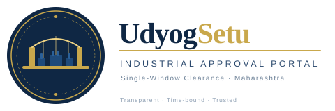
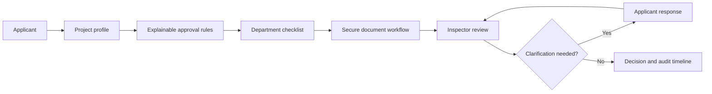
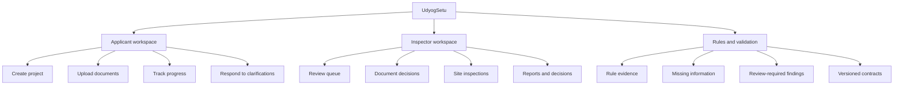
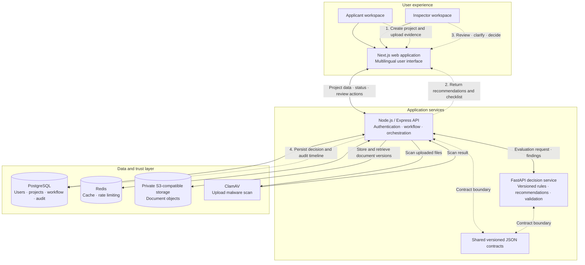
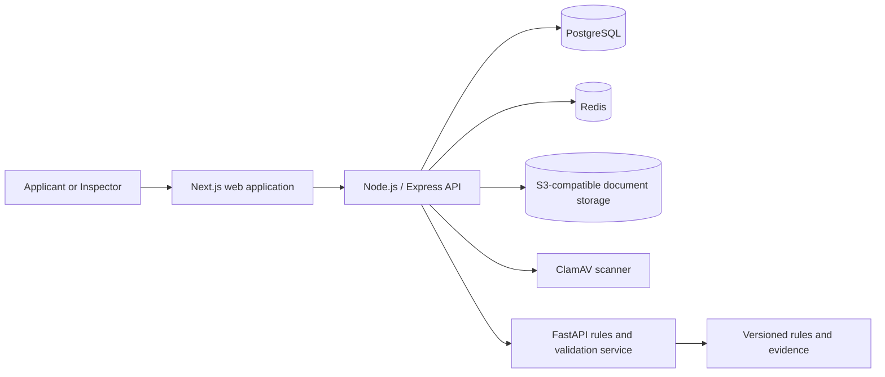
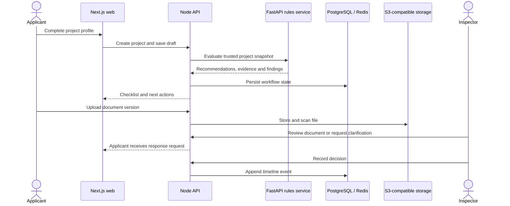

<div align="center">




### A guided, transparent approval journey for industrial projects

UdyogSetu brings project intake, approval discovery, document preparation,
department review, clarifications, inspections and decisions into one secure
workflow for applicants and government departments.

</div>

<p align="center">
  <strong>Applicant workspace</strong> · <strong>Inspector workspace</strong> · <strong>Explainable rules</strong> · <strong>Multilingual access</strong>
</p>

<p align="center">
  
</p>

<p align="center"><em>One digital journey from industrial project profile to department decision.</em></p>

---

## Why UdyogSetu?

Industrial applicants often have to coordinate with multiple departments,
interpret changing document requirements and follow up through disconnected
channels. Departments, in turn, need a consistent intake process, a focused
review queue and an auditable record of every clarification and decision.

UdyogSetu creates a shared journey:

```text
Project profile
      ↓
Approval recommendations
      ↓
Department-wise document checklist
      ↓
Secure upload and validation
      ↓
Inspector review and clarification
      ↓
Decision with an auditable timeline
```

The platform currently supports screening workflows for food processing,
textiles and steel and metals projects, with a Maharashtra-focused rules
context.

### At a glance

| 🏭 **For applicants** | 🧾 **For departments** | ⚙️ **For engineering teams** | 🌐 **For access** |
| --- | --- | --- | --- |
| Guided project intake, document checklist and status tracking | Review queue, clarifications, inspections and decisions | Contract-driven Node.js and FastAPI services | English, Hindi and Marathi language support |



## Product overview

| Workspace | Capabilities |
| --- | --- |
| **Applicant** | Register and authenticate, create a project, complete a guided questionnaire, view recommended approvals, upload document versions, respond to clarifications and track department progress. |
| **Inspector** | View assigned applications, triage the review queue, inspect documents, request clarification, record document outcomes, make approval decisions and monitor inspections, reports and workload. |
| **Rules and validation** | Normalize project data, evaluate versioned rules, explain recommendations, identify missing or inconsistent information and preserve review-required states. |
| **Language access** | English, Hindi and Marathi are available in the frontend localization layer. |

## Core capabilities

### Guided project intake

The applicant wizard collects:

- Business identity and organization details
- Industrial location, land and plot information
- Activity, capacity, investment, shifts and equipment
- Power, water, wastewater and hazardous-waste information
- Workforce and worker-accommodation details
- Sector-specific inputs for food, textile and steel projects

### Explainable approval discovery

The rules service evaluates the project snapshot using a pinned rules version.
Each recommendation can carry its rule ID, explanation, department, evidence,
dependencies and document metadata.

The current rule set includes screening paths for:

- Food-related licensing
- Factory registration
- Fire safety NOC
- Consent-to-operate review
- Boiler registration review
- Internal business-profile preparation

### Document workflow

Applicants can upload documents against an approval requirement, see accepted
formats and quality guidance, replace a document with a newer version and
follow the review state. Inspectors can open documents, accept them, request a
correction or reject them with a reason.

### Human review and clarifications

The platform keeps uncertain or incomplete cases visible instead of silently
marking them as approved. Inspectors can open a clarification thread, attach a
document when needed, set a due date and receive an applicant response in the
same application record.

## Role-based product map



<table>
  <tr>
    <td width="33%" valign="top">
      <h3>👤 Applicant</h3>
      <p>Completes one guided profile, receives a tailored preparation checklist and follows every request from the departments.</p>
    </td>
    <td width="33%" valign="top">
      <h3>🛡️ Inspector</h3>
      <p>Works from a department-scoped queue, reviews evidence, asks focused questions and records reasoned outcomes.</p>
    </td>
    <td width="33%" valign="top">
      <h3>🔍 Rules service</h3>
      <p>Explains how a recommendation was reached and keeps uncertainty visible for owner or department confirmation.</p>
    </td>
  </tr>
</table>

### Secure workflow foundations

- Separate applicant and inspector access paths
- Password authentication with OTP verification and recovery flows
- Short-lived access tokens and refresh tokens
- Server-side role and ownership checks
- API rate limiting backed by Redis
- Object-storage integration with signed download URLs
- Optional ClamAV scanning for uploaded files
- Redacted structured logging and fail-closed validation paths

## Architecture

### Integrated system architecture and data flow

The diagram below shows the current UdyogSetu services and the end-to-end flow
from project intake through rules evaluation, document validation, inspector
review and decision.





### Service boundaries

| Layer | Responsibility | Location |
| --- | --- | --- |
| **Web** | UI, role-specific workspaces, localization and API calls | `apps/web` |
| **Node API** | Authentication, sessions, projects, documents, inspectors, persistence and orchestration | `node-backend` |
| **Python service** | Rule evaluation, approval recommendations, dependency assessment and document validation findings | `python-backend` |
| **Contracts** | Versioned JSON schemas and request/response examples shared across services | `packages/contracts` |
| **Infrastructure** | Local PostgreSQL, Redis, MinIO and ClamAV services | `docker-compose.yml`, `infra` |

The Node API owns users, workflow state, PostgreSQL and document-storage
coordination. The Python service is an internal, stateless decision service.
The services communicate through the contract models under
`packages/contracts`.

### End-to-end system flow



## Repository layout

```text
.
├── apps/web/                 Next.js applicant and inspector frontend
├── node-backend/             Express API, persistence and workflow modules
├── python-backend/           FastAPI rules and validation service
├── packages/contracts/       Shared schemas and integration examples
├── docs/                     Architecture, API and security documentation
├── infra/                    Deployment and infrastructure material
├── scripts/                  Repository automation
├── api-contract.md           Node-to-Python contract reference
├── docker-compose.yml        Local PostgreSQL, Redis, MinIO and ClamAV
└── .env.example              Local infrastructure variables
```

## Quick start

### Prerequisites

- Node.js `>=22.13.0`
- pnpm `11.26.0`
- Python `3.11+` recommended
- Docker Desktop with Compose

### 1. Start local infrastructure

From the repository root:

```powershell
Copy-Item .env.example .env
docker compose up -d
```

Replace the `CHANGE_ME` values in `.env` before starting services that use the
database, Redis or object storage.

### 2. Start the Node API

```powershell
Set-Location node-backend
Copy-Item .env.example .env
pnpm install
pnpm dev
```

The API listens on `http://localhost:4000` by default. It serves versioned
routes under `/api/v1`.

### 3. Start the Python decision service

```powershell
Set-Location python-backend
py -m venv .venv
.\.venv\Scripts\python.exe -m pip install -r requirements.txt
$env:INTERNAL_API_TOKEN = "replace-with-a-local-token"
.\.venv\Scripts\python.exe -m uvicorn app.main:app --reload --host 127.0.0.1 --port 8000
```

The service exposes:

- `GET /health`
- `POST /evaluate`
- `POST /validate`

The evaluation and validation routes require the internal token. Keep the
service private and do not commit real secrets.

### 4. Start the web application

In a separate terminal:

```powershell
Set-Location apps/web
pnpm install
pnpm dev
```

Open `http://localhost:3000`. The frontend uses same-origin `/api/v1` calls;
configure the Next.js development proxy when running the API separately.

## Testing and validation

Run focused checks from each package:

```powershell
# Frontend
Set-Location apps/web
pnpm test
pnpm typecheck
pnpm lint

# Node API
Set-Location ../../node-backend
pnpm test
pnpm typecheck
pnpm lint

# Python service
Set-Location ../python-backend
.\.venv\Scripts\python.exe -m unittest discover -s tests -v
```

Package-level validation commands are also available:

```powershell
Set-Location apps/web
pnpm validate

Set-Location ../../node-backend
pnpm validate
```

The Node end-to-end suite expects a configured PostgreSQL environment. The
Python validation guidance is documented in `python-backend/VALIDATION.md`.

## Rules, evidence and trust model

Rules are pinned through `python-backend/app/rules/sets/2026.09/manifest.json`.
They are designed for explainable preliminary screening, not automatic legal
determination.

Important behavior:

- `matched` means a screening rule matched the supplied project snapshot.
- `needs_review` means the result needs owner or department confirmation.
- `insufficient_information` means required decision inputs are missing.
- `not_matched` does not establish a legal exemption.
- Prototype document policies are not statutory requirements.
- Processing-day values in examples are estimates, not official SLAs.
- Upload success cannot clear an unresolved regulatory applicability review.

The evidence record and current limitations are maintained in:

- `python-backend/app/rules/README.md`
- `python-backend/VALIDATION.md`
- `python-backend/DOCUMENT_PROCESSING.md`
- `python-backend/PERSON1_PERSON2_HANDOFF.md`

## Current scope and limitations

The project is an active prototype and integration foundation. Before a
production launch, the team still needs to complete or validate:

- Current department-approved applicability rules and complete checklists
- Regulatory review for food, factory, fire, pollution and boiler paths
- Production OCR and bounded document-parser workers
- Owned storage transport and deployment configuration
- Full government-system integrations
- Production inspection scheduling, geo-tagging and reporting integrations
- Authoritative registration and legal-verification workflows
- Final submission-gate integration across every deployment environment

Do not present the screening engine as legal advice or claim guaranteed
approval timelines. The system intentionally preserves uncertainty for human
review.

## Security notes

- Keep `.env` files and credentials outside version control.
- Use different strong secrets for access tokens, refresh tokens and OTPs.
- Never use `OTP_DEVELOPMENT_CODE` in production.
- Keep the Python service on a private network and require its internal token.
- Do not log raw document bytes, extracted credentials or private tokens.
- Keep storage buckets private and use short-lived signed URLs.
- Treat browser-supplied document metadata as untrusted.

## Documentation map

- `docs/architecture/repository-structure.md` — service ownership and repository boundaries
- `api-contract.md` — Node-to-Python request and response examples
- `python-backend/VALIDATION.md` — validation behavior and submission-gate requirements
- `python-backend/DOCUMENT_PROCESSING.md` — document-processing boundary and limitations
- `packages/contracts/examples` — contract fixtures for evaluation and validation flows
- `node-backend/migrations` — PostgreSQL schema history

## Project status

Maitri 3.0 is being developed as a secure, explainable single-window
industrial approval workflow. The current branch contains the applicant
journey, inspector review foundation, versioned screening rules, shared
contracts, document workflow and multilingual frontend foundations.

Contributions should preserve the service boundaries, contract compatibility,
security controls and distinction between preliminary screening and confirmed
regulatory applicability.
