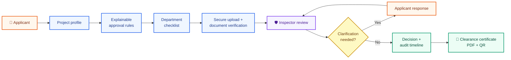
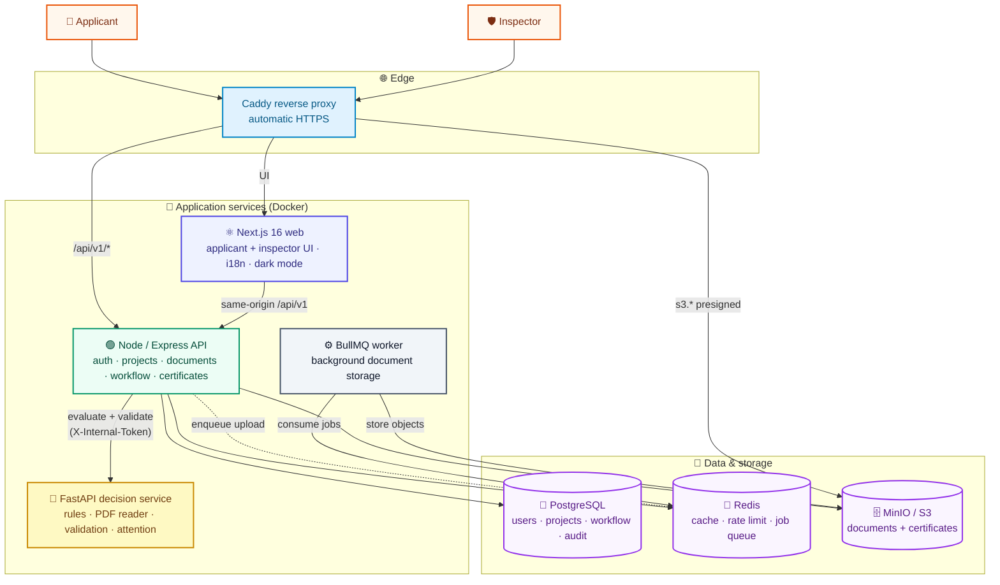
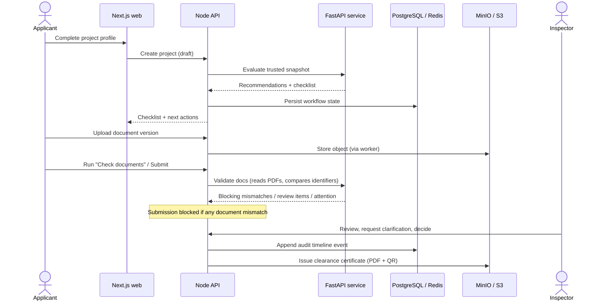

<div align="center">


### A guided, transparent, single-window approval journey for industrial projects

UdyogSetu brings project intake, approval discovery, document preparation and
**verification**, department review, clarifications, inspections, decisions and
**digital clearance certificates** into one secure workflow for applicants and
government departments.

</div>

<p align="center">
  <strong>Applicant workspace</strong> · <strong>Inspector workspace</strong> · <strong>Explainable rules</strong> · <strong>Document verification</strong> · <strong>Multilingual · Dark mode</strong>
</p>

<p align="center">
  
</p>

<p align="center"><em>One digital journey from industrial project profile to department decision and clearance certificate.</em></p>

<p align="center">
  <a href="https://udyogsetu.live"><strong>🔗 Live demo → https://udyogsetu.live</strong></a>
</p>

---

## Why UdyogSetu?

Industrial applicants often have to coordinate with multiple departments,
interpret changing document requirements and follow up through disconnected
channels. Departments, in turn, need a consistent intake process, a focused
review queue, real confidence that uploaded documents belong to the applicant,
and an auditable record of every clarification and decision.

UdyogSetu creates a shared journey:



The platform currently supports screening workflows for **food processing**,
**textiles** and **steel & metals** projects, with a Maharashtra-focused rules
context.

### At a glance

| 🏭 **For applicants** | 🧾 **For departments** | ⚙️ **For engineering teams** | 🌐 **For access** |
| --- | --- | --- | --- |
| Guided intake, checklist, document verification, status tracking and clearance certificate | Department review queue, clarifications, inspections and reasoned decisions | Contract-driven Node.js + FastAPI services, containerised for one-command deploy | English · Hindi · Marathi, light & dark mode |

## Product overview

| Workspace | Capabilities |
| --- | --- |
| **Applicant** | Register (phone + password + OTP), create a project, complete a guided questionnaire, view recommended approvals, upload/replace document versions, **resume a draft**, respond to clarifications, track department progress and download the clearance certificate. |
| **Inspector** | Sign in with a ministry-issued access code, work a department-scoped review queue, preview documents inline, see automated verification results, request clarification, record document outcomes, make approval decisions and monitor inspections, reports and workload. |
| **Rules & validation** | Normalise project data, evaluate versioned rules, explain recommendations, read uploaded PDFs and **compare their identifiers against the application**, and preserve review-required states. |
| **Access** | English, Hindi and Marathi throughout the interface, plus a persistent light/dark theme toggle. |

## Core capabilities

### 🧭 Guided project intake

A resumable multi-step wizard collects business identity, location and land,
activity/capacity/investment, utilities (power, water, wastewater, hazardous
waste), workforce, and sector-specific inputs for food, textile and steel
projects. Drafts are saved server-side and can be reopened via **“Continue
application.”**

### 💡 Explainable approval discovery

The rules service evaluates the project snapshot using a **pinned rules version**.
Each recommendation carries its rule ID, explanation, department, evidence,
dependencies and document metadata. The current rule set includes screening
paths for food licensing, factory registration, fire-safety NOC,
consent/environmental review, boiler registration and internal business-profile
preparation.

### 🔎 Document upload **and verification** (hardened)

Applicants upload documents against each approval requirement. When a document
is submitted, the Python decision service **reads the PDF text and extracts
identifiers** (PAN, GSTIN, CIN, Udyam, PIN code) and compares them to the
applicant's answers:

- A **mismatched strict identifier** (e.g. the CIN on a company-registration PDF
  differs from the entered CIN) is a **blocking error** — the wrong document
  cannot be submitted.
- A **match** is surfaced to the officer as *“matches the application — confirm
  authenticity.”* Automated reading **never auto-approves** a document; it is
  fail-closed by design.

Inspectors get an inline PDF preview, one clean verification line per document,
and can accept, request a correction, or reject with a reason.

### 🗣️ Human review and clarifications

Uncertain or incomplete cases stay visible instead of being silently approved.
Inspectors open a clarification thread, optionally link a document, set a due
date, and the applicant responds inside the same application record. Findings and
review items are **scoped to the inspector's own department**.

### 📜 Clearance certificates

When every required approval is granted, a **permanent clearance certificate** is
auto-issued as a PDF with a QR code and a public verification code, downloadable
by the applicant and verifiable by anyone.

### 🔔 Notifications & 🌗 theming

An in-app notification bell keeps applicants and inspectors updated on
submissions, clarifications and decisions. The interface ships in English, Hindi
and Marathi with a persistent light/dark theme toggle.

## Architecture

UdyogSetu runs as containerised services behind a single reverse proxy. The Node
API owns users, workflow state, PostgreSQL and document-storage coordination; the
Python service is an internal, stateless decision service; a separate worker
process handles background object-storage uploads.



### Service boundaries

| Layer | Responsibility | Location |
| --- | --- | --- |
| **Web** | UI, role-specific workspaces, localization, theming and API calls | `apps/web` |
| **Node API** | Auth, sessions, projects, documents, inspectors, certificates, notifications, persistence and orchestration | `node-backend` |
| **Worker** | Background document-storage uploads via BullMQ (separate process, same image) | `node-backend` (`src/worker.ts`) |
| **Python service** | Rule evaluation, recommendations, dependency assessment, PDF reading and document-verification findings | `python-backend` |
| **Contracts** | Versioned JSON schemas and request/response examples shared across services | `packages/contracts` |
| **Infrastructure** | PostgreSQL, Redis, MinIO, Caddy (prod) / ClamAV (optional, dev) | `docker-compose.yml`, `docker-compose.prod.yml`, `infra/` |

The services communicate through the contract models under `packages/contracts`,
and the Node → Python calls are authenticated with a shared internal token.

### End-to-end system flow



## Tech stack

| Area | Technology |
| --- | --- |
| Web | Next.js 16 (App Router), React 19, Tailwind CSS v4, TanStack Query |
| API | Node.js ≥ 22, Express 5, Zod, Argon2id, JWT, BullMQ, pdfkit + qrcode |
| Decision service | Python 3.12, FastAPI, pypdf |
| Data | PostgreSQL 17, Redis 8, MinIO / S3 (via AWS SDK, presigned URLs) |
| Delivery | Docker + Docker Compose, Caddy (automatic HTTPS), GitHub Actions |

## Repository layout

```text
.
├── apps/web/                    Next.js applicant + inspector frontend
├── node-backend/                Express API, worker, persistence, workflow
│   ├── src/worker.ts            Background document-storage worker
│   ├── migrations/              PostgreSQL schema history
│   └── scripts/seed-inspectors  Provision inspectors from a JSON file
├── python-backend/              FastAPI rules + document-verification service
├── packages/contracts/          Shared schemas and integration examples
├── infra/docker/Caddyfile       Reverse proxy + automatic HTTPS
├── docs/DEPLOYMENT.md           Single-box AWS EC2 deployment runbook
├── docker-compose.yml           Local dev infra (Postgres, Redis, MinIO, ClamAV)
├── docker-compose.prod.yml      Full production stack (all services + Caddy)
├── .env.example                 Local infrastructure variables
└── .env.prod.example            Production environment template
```

## Quick start (local development)

### Prerequisites

- Node.js `>= 22.13.0` and pnpm `11.26.0`
- Python `3.12+`
- Docker Desktop with Compose

### 1. Start local infrastructure

```bash
cp .env.example .env          # fill in the CHANGE_ME values
docker compose up -d          # Postgres, Redis, MinIO (+ ClamAV)
```

### 2. Start the Node API

```bash
cd node-backend
cp .env.example .env
pnpm install
pnpm migrate:up               # apply database migrations
pnpm dev                      # API on http://localhost:4000  (routes under /api/v1)
# optional, in another terminal:
pnpm dev:worker               # background storage worker
```

### 3. Start the Python decision service

```bash
cd python-backend
python -m venv .venv && source .venv/bin/activate
pip install -r requirements.txt
INTERNAL_API_TOKEN=local-dev-token \
  uvicorn app.main:app --reload --host 127.0.0.1 --port 8000
```

Exposes `GET /health`, `POST /evaluate`, `POST /validate` (the last two require
the internal token). To enable PDF reading + identifier verification locally, set
`DOCUMENT_READER_ENABLED=true` on this service and
`VALIDATION_INCLUDE_DOCUMENT_BYTES=true` on the Node API.

### 4. Start the web application

```bash
cd apps/web
pnpm install
pnpm dev                      # http://localhost:3000
```

> On Windows, run the equivalent PowerShell commands (`Copy-Item`, `Set-Location`,
> `.\.venv\Scripts\Activate.ps1`).

## Deployment

The full stack ships as a single-box **Docker Compose** deployment with a Caddy
reverse proxy that provisions **automatic HTTPS** (no domain required — it can use
`<ec2-ip>.sslip.io`). It runs web, API, worker, the Python service, PostgreSQL,
Redis and MinIO, with a one-shot migration job.

```bash
cp .env.prod.example .env.prod          # set SITE_HOST + generated secrets
docker compose --env-file .env.prod -f docker-compose.prod.yml up -d --build
# provision inspectors (one per department):
docker compose --env-file .env.prod -f docker-compose.prod.yml \
  run --rm -v "$PWD/inspectors.json:/app/inspectors.json" \
  migrate pnpm seed:inspectors /app/inspectors.json
```

A complete, first-time AWS EC2 walkthrough (instance, Elastic IP, Docker, DNS,
secrets, operations and teardown) is in **[`docs/DEPLOYMENT.md`](docs/DEPLOYMENT.md)**.

## Testing and validation

```bash
# Frontend
cd apps/web && pnpm test && pnpm typecheck && pnpm lint

# Node API
cd node-backend && pnpm test && pnpm typecheck && pnpm lint

# Python service
cd python-backend && python -m pytest -q
```

Package-level `pnpm validate` scripts bundle format/lint/typecheck/test/build.
The Node end-to-end suite expects a configured PostgreSQL environment.

## Rules, evidence and trust model

Rules are pinned through `python-backend/app/rules/sets/2026.09/manifest.json` and
are designed for **explainable preliminary screening, not automatic legal
determination**. Key behaviour:

- `matched` means a screening rule matched the supplied snapshot.
- `needs_review` means the result needs owner/department confirmation.
- `insufficient_information` means required decision inputs are missing.
- `not_matched` does not establish a legal exemption.
- A document **identifier match never auto-approves**; a **mismatch blocks**.
- Prototype document policies are not statutory requirements, and processing-day
  values are estimates, not official SLAs.

Evidence and limitations live in `python-backend/app/rules/README.md`,
`python-backend/VALIDATION.md` and `python-backend/DOCUMENT_PROCESSING.md`.

## Security notes

- **Applicants** authenticate with phone + password and OTP verification;
  **inspectors** do not self-register — they are provisioned by the ministry and
  sign in with a phone number + access code (stored as an Argon2id hash).
- Keep `.env` / `.env.prod` and `inspectors.json` out of version control (they
  are git-ignored).
- Use different strong secrets for access tokens, refresh tokens, the OTP secret
  and the internal Node↔Python token. Never use `OTP_DEVELOPMENT_CODE` in a real
  production posture.
- Keep the Python service on a private network behind its internal token.
- Keep storage buckets private and serve documents/certificates via short-lived
  presigned URLs. Never log raw document bytes, extracted identifiers or tokens.
- Auth cookies are `HttpOnly`; API rate limiting is backed by Redis.

## Current scope and limitations

An active prototype and integration foundation. Working today: the full applicant
journey, resumable drafts, department-scoped inspector review, versioned screening
rules, **identifier-based document verification that blocks mismatched
documents**, auto-issued clearance certificates, notifications, multilingual +
dark-mode UI, and a one-command containerised deployment.

Still to complete or validate before a production launch:

- Department-approved applicability rules and complete statutory checklists
- **OCR for scanned/photographed documents** (current reading is PDF text-layer)
  and **fuzzy business-name matching**
- Regulatory review across food, factory, fire, pollution and boiler paths
- Full government-system and authoritative registration/verification integrations
- Production inspection scheduling, geo-tagging and reporting integrations

Do not present the screening engine as legal advice or claim guaranteed approval
timelines — the system intentionally preserves uncertainty for human review.

## Documentation map

- [`docs/DEPLOYMENT.md`](docs/DEPLOYMENT.md) — single-box AWS EC2 deployment runbook
- [`docs/architecture/repository-structure.md`](docs/architecture/repository-structure.md) — service ownership and boundaries
- [`api-contract.md`](api-contract.md) — Node ↔ Python request/response examples
- `python-backend/VALIDATION.md` — validation behaviour and submission-gate rules
- `python-backend/DOCUMENT_PROCESSING.md` — document-processing boundary and limits
- `packages/contracts/examples` — contract fixtures for evaluation and validation
- `node-backend/migrations` — PostgreSQL schema history

## Project status

Maitri 3.0 / UdyogSetu is a secure, explainable single-window industrial approval
workflow: applicant journey, inspector review, versioned screening rules, shared
contracts, verified document workflow, clearance certificates and a multilingual,
themeable frontend — deployable as one containerised stack.

Contributions should preserve the service boundaries, contract compatibility,
security controls and the distinction between preliminary screening and confirmed
regulatory applicability.
